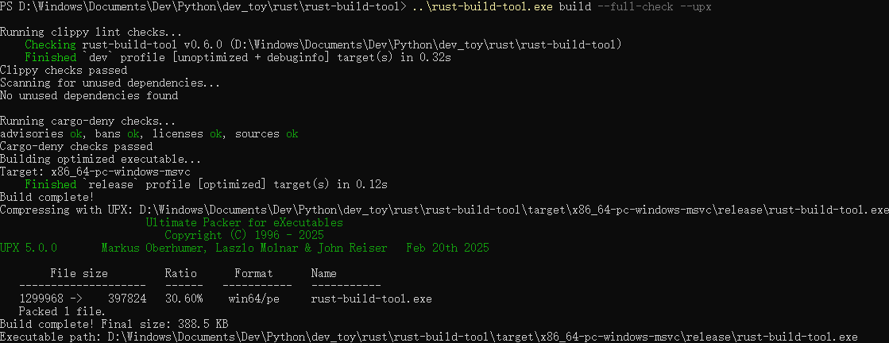

# Rust Build Tool

A powerful tool for building optimized Rust executables with additional quality assurance features.

## Features

- 🚀 Optimized builds with LTO and maximum optimization
- 🔍 Detect and remove unused dependencies
- 🗜️ UPX compression support
- 🖥️ Cross-platform support
- ⚡ Fast builds with sensible defaults
- ✅ Invoke quality checks (clippy, cargo-deny, depcheck)



## Requirements

- Rust toolchain (nightly must be installed but not set as default)
- cargo-udeps (for dependency checking)
- UPX with LZMA support (optional, for compression)

### Prerequisites Installation

- Nightly version of rustc

  ```bash
  rustup install nightly
  ```

- cargo-udeps

  ```bash
  cargo install cargo-udeps
  ```

- cargo-deny

  ```bash
  cargo install cargo-deny
  ```

## Project Initialization

### Initialize Deny

```bash
cargo deny init
```

## Installation

From source locally:
```bash
cargo install --path .
```

From git repository:
```bash
cargo install --git https://github.com/yzyf1312/rust-build-tool.git
```

To build and run directly from source with UPX compression:
```bash
cargo run -- build --upx
```

## Usage

### Build Command

```bash
rust_build_tool build [OPTIONS]
```

Options:
- `--target`: Specify target platform (default: auto-detect)
- `--upx`: Enable UPX compression
- `--clean`: Clean before building
- `--clippy`: Run clippy lint checks
- `--deny`: Run cargo-deny dependency audits
- `--full-check`: Run complete QA workflow (clippy -> depcheck -> deny -> build)

Example:
```bash
rust_build_tool build --target x86_64-unknown-linux-gnu --upx
```

### Dependency Check

```bash
rust_build_tool depcheck
```

This will scan for unused dependencies and prompt for removal confirmation.

## Configuration

The tool automatically configures these release profile settings:
- opt-level = 'z'
- lto = true
- codegen-units = 1
- panic = 'abort'
- strip = true

## Examples

1. Simple build:
```bash
rust_build_tool build
```

2. Build with UPX compression:
```bash
rust_build_tool build --upx
```

3. Check and remove unused dependencies:
```bash
rust_build_tool depcheck
```

4. Run complete quality assurance workflow:
```bash
rust_build_tool build --full-check
```

This will run the following checks in sequence:
1. Clippy lint checks
2. Dependency check (depcheck)
3. Cargo-deny dependency audits
4. Final build

5. Run individual quality checks:
```bash
rust_build_tool build --clippy --deny
```

## Best Practices

- For maximum optimization, use the `--upx` flag to compress the final executable
- Regularly run `depcheck` to keep your dependencies clean
- For cross-compiling, explicitly specify the target with `--target`
- The tool automatically applies optimal release profile settings
- Consider using this tool in CI/CD pipelines for consistent builds

## Contributing

Contributions are welcome! Please open an issue or submit a pull request.

1. Fork the repository
2. Create your feature branch
3. Commit your changes
4. Push to the branch
5. Open a pull request
